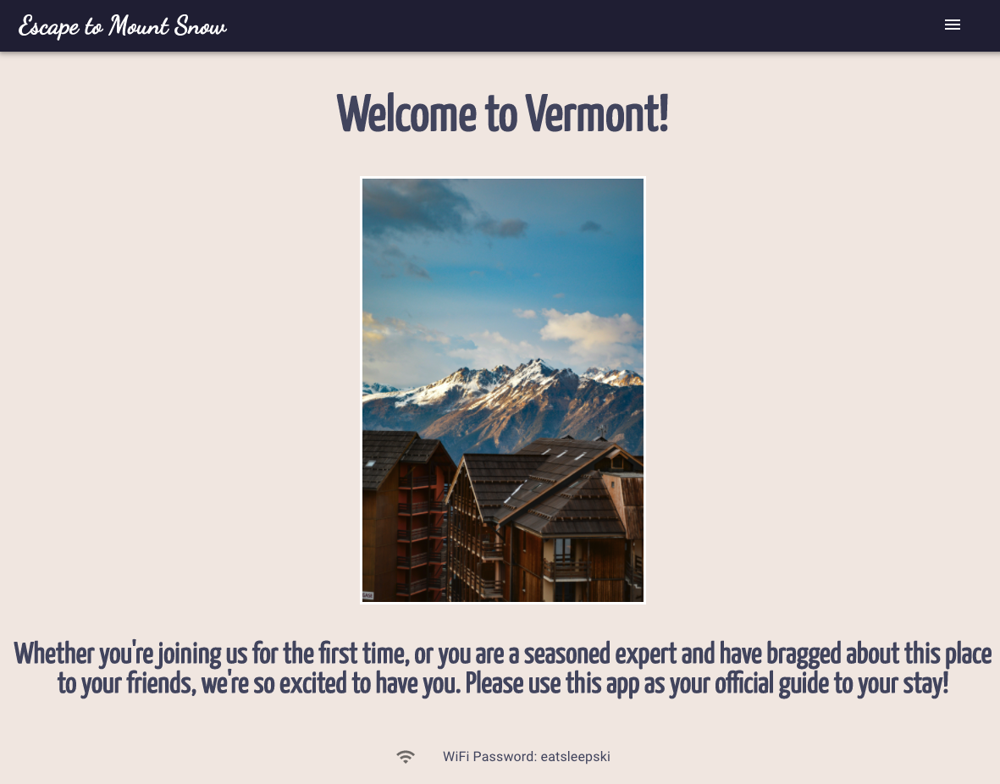
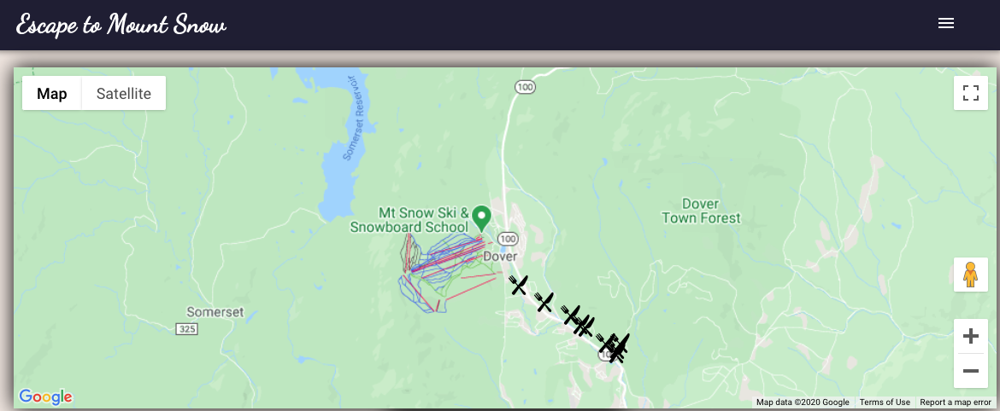
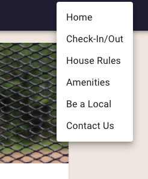

Escape to Mount Snow (visit: https://heuristic-hamilton-019363.netlify.app/)

This app is primarily designed to be used on an iPad as a digital informational booklet inside an Airbnb rental at Mount Snow, VT. I've integrated Material UI as well as Google Maps API into the design to give the end user a more immersive experience.

This is the home page, what you'll see when you first arrive at the application.

Here is the integrated Google Maps API component.

This is an example of the navigational framework.

